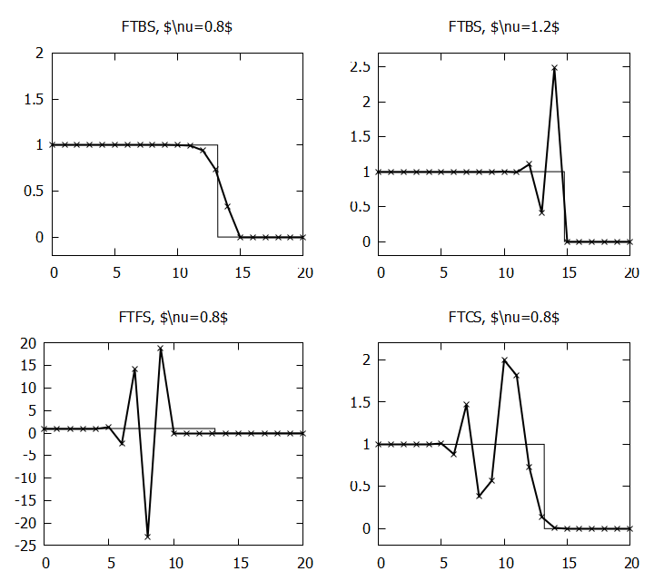

# 01 線形波動方程式の差分法

FTBSとFTFSを適切に選ぶことが必要。
今回の場合, FTBSではCFL数を適切に選ぶことで安定になり, 
FTFS, FTCSでは不安定が発生する。

    

$u_i^{n+1}=u_i^n-\frac{\nu}{2}(u_{i+1}^n-u_{i-1}^n)+\frac{|\nu|}{2}(u_{i-1}^n-2u_i^n+u_{i+1}^n)$
とすることで, FTBSもFTFSも含んだ風上差分法の式になる。