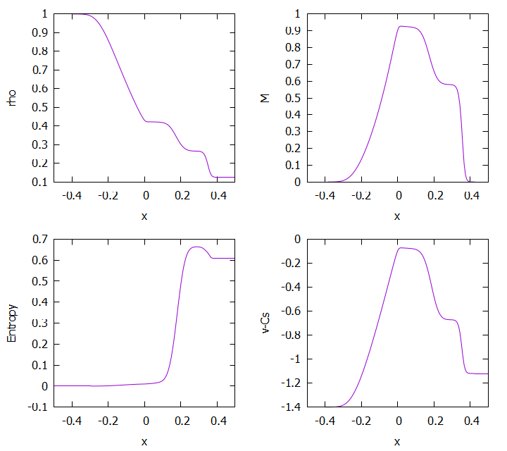
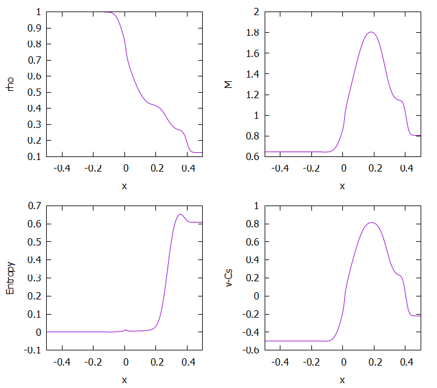

# Roeの風上差分法

## 実行結果
$\rho_{\mathrm{L}}=1, p_{\mathrm{L}}=1, v_{\mathrm{L}}=0, \rho_{\mathrm{R}}=0.125, p_{\mathrm{R}}=0.1, v_{\mathrm{L}}=0, t=0.2$

    

$\rho_{\mathrm{L}}=1, p_{\mathrm{L}}=1, v_{\mathrm{L}}=0.9, \rho_{\mathrm{R}}=0.125, p_{\mathrm{R}}=0.1, v_{\mathrm{L}}=0.9, t=0.15$

    

