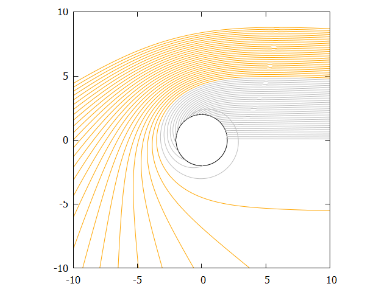
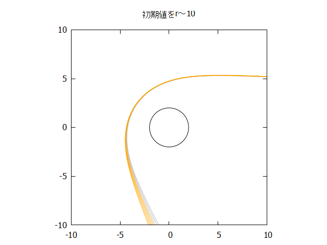
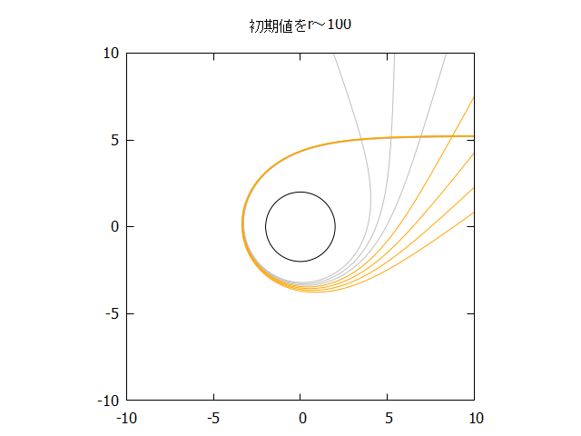
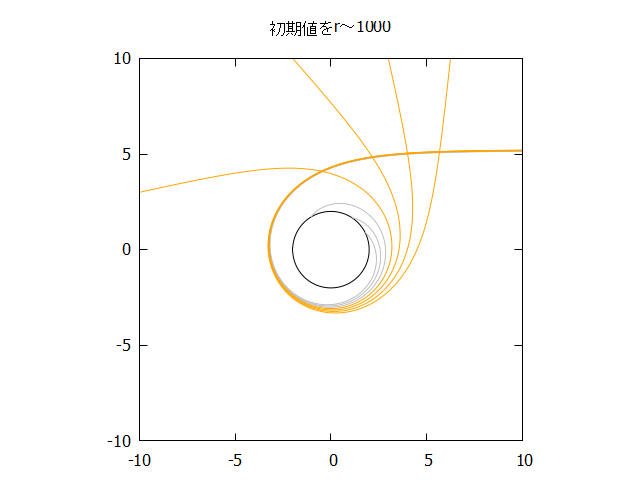
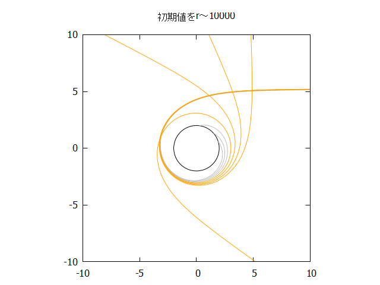
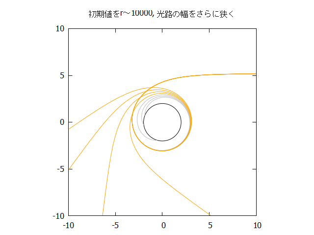

# impact paramの臨界値について
## 目的
BH shadowの数値計算について, impact parameterの臨界値が$3\sqrt{3}\frac{GM}{c^2}$であることを確かめたい。その結果が下図である。

今回コードでG=1, M=1, c=1としたため, $y>3\sqrt{3}\sim 5.2$より下から生えている光路については天体に吸い込まれてほしいが, この図ではそうなっていない。ただ, すごい微妙なので誤差の可能性もあるので, それを検証しようとしてみる。

## 仮説
以下の2つについて考える。
- 初期値が (この図で) $x=10$と比較的近いところにあることから, 光が自分の思っているよりも曲げられていて, 実際に臨界値は$3\sqrt{3}$にある。
- BH付近での刻み幅が小さいことによる誤差 (数値計算の結果を見てもわかる通り, BHに近ければ近いほどかなり繊細で, 誤差により少しずつ外側にずらされている)。

## 検証
初期値として$b=3\sqrt{3}$に極めて近いところのみを取り出し, メモリを節約しつつ刻み幅を小さくした。以下の図について, すべてグレーは光がBHに吸い込まれてほしいところ ($b<3\sqrt{3}$), オレンジは$b\geq3\sqrt{3}$のところである。

まず, 刻み幅を最初に書いたコードのおよそ10倍細かくした。
その上で, 初期値を遠ざけた。その結果を以下に示す。

上記の通り色々試した結果, "遠いところの距離$b=3\sqrt{3}$"から光を出すと結果が変わってくることから, 自分の理解不足で光路が想定以上に曲げられていて, "十分遠い"距離$b=3\sqrt{3}$の地点からやるとほしい結果が得られることが分かった。

impact parameterへの理解が不十分だった気がするので, 認識を改める機会となりよかった。